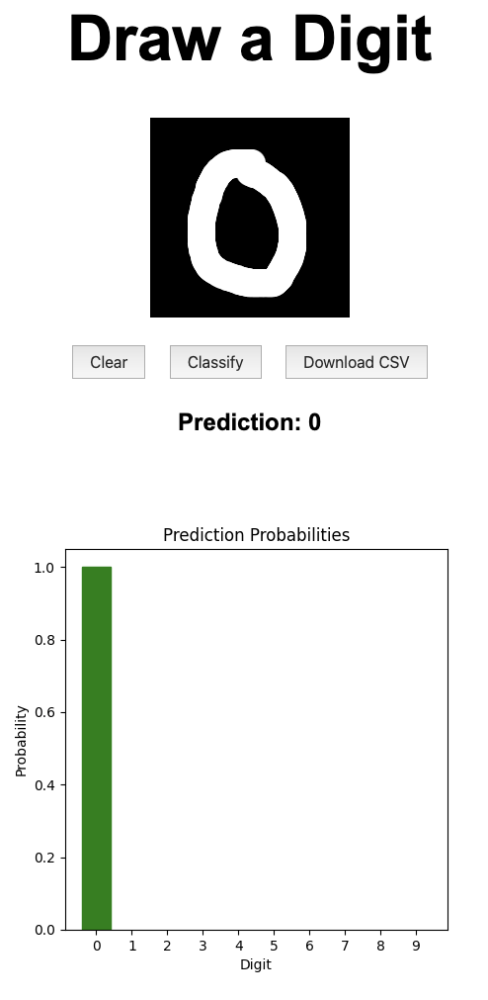
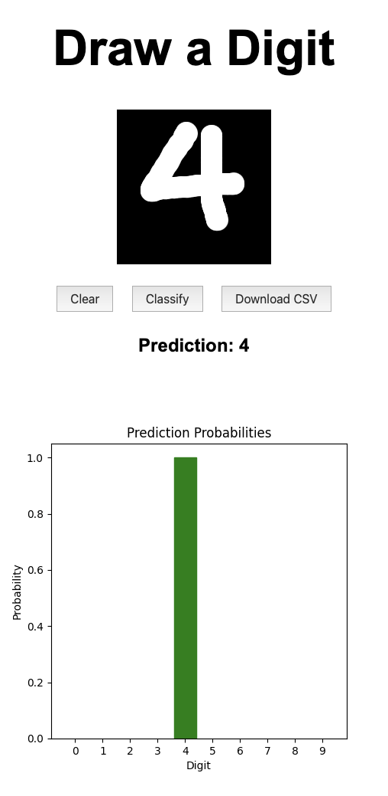

# Digit ML Classifier

A simple website where users can draw a digit (0–9), and a machine learning model will try to guess what they drew.

## 🚀 Live Demo

Click this link to play with the project:
[Deployed on Render](https://digit-ml-classifier.onrender.com)  
*(May take a few minutes to load on free hosting)*

<table>
	<tr>
		<td></td>
		<td></td>
	</tr>
</table>

## 🧠 Model

- Trained on the [Kaggle Digit Recognizer competition dataset](https://www.kaggle.com/competitions/digit-recognizer/data), based on the MNIST dataset.
- Uses a convolutional neural network (CNN) built with **Keras** and **TensorFlow**.

## 🛠 Technologies Used

- **Python**
- **Flask** – for the backend and routing
- **TensorFlow / Keras** – for training and running the digit classifier
- **OpenCV** – to process the user’s drawing before prediction
- **Matplotlib** – to generate a probability graph of predictions
